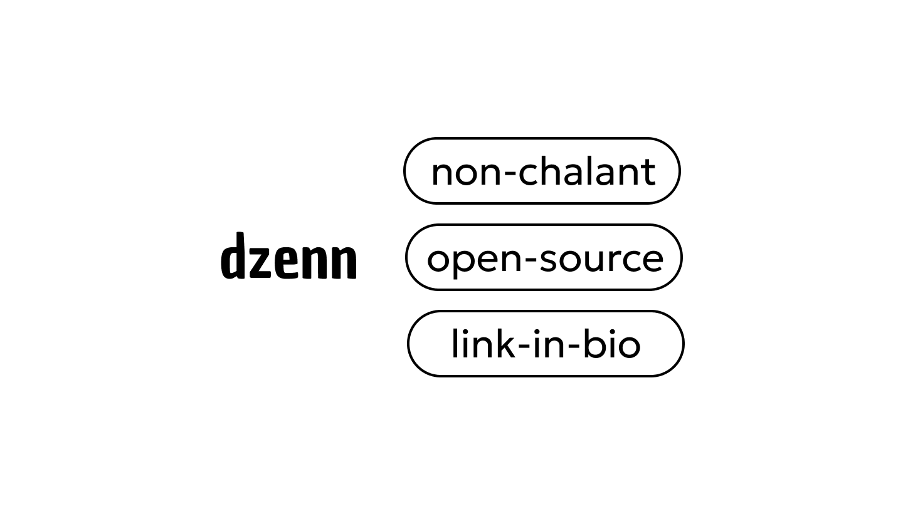

<p align="center">
  <a href="https://dzenn.live">
    
  </a>
</p>

<h3 align="center">Dzenn</h3>
<p align="center">
    Not your ordinary linktree
    <br />
    <br />
    <a href="#hello"><strong>Introduction</strong></a> ·
    <a href="#ongoing"><strong>Ongoing</strong></a> ·
    <a href="#tech-stack"><strong>Tech Stack</strong></a> ·
    <a href="#project-structure"><strong>Project Structure</strong></a> ·
    <a href="#license"><strong>License</strong></a>
</p>

<br/>

## Hello

Dzenn is an open-source **Link-in-Bio** platform designed for creators who demand more than just a list of buttons. It's a "nonchalant" alternative for the creative elite, prioritizing premium aesthetics and a high-end user experience over generic templates.

What makes it different?

- **Total Design Freedom:** Customize backgrounds, patterns, and card layouts to match your unique vibe.
- **Premium Aesthetics:** Integrated support for **Glassy Textures**, dynamic background patterns (**Waves, Noise, Grids**), and fluid micro-animations.
- **Creator-Centric:** Built for digital nomads and visionaries who value visual excellence and a clean digital presence.
- **Open Source & Free:** Dzenn offers a powerful free-forever experience. Built by the community, for the community, with a focus on core freedom.

Replace your boring static links with a stunning, interactive page that actually hits different.

<br/>

## Ongoing

- [ ] Support multiple link
- [ ] Add rich components (YouTube, Twitter/X, blog posts, Spotify)
- [ ] More card design variations (glassmorphism, neumorphism, etc)
- [ ] Custom domain support
- [ ] Advanced analytics (geographic data, referrers)

## Tech Stack

- **Framework:** Next.js 15 (App Router)
- **Language:** TypeScript
- **Database:** PostgreSQL with Prisma ORM
- **Authentication:** Better Auth
- **File Upload:** AWS S3
- **State Management:** Zustand + TanStack Query
- **Styling:** Tailwind CSS
- **UI Components:** shadcn/ui + Radix UI

## Project Structure

```
dzenn/
├── app/                    # Next.js app directory
│   ├── (auth)/            # Authentication routes (login, signup)
│   ├── editor/            # Editor routes (protected)
│   ├── [username]/        # Public profile pages
│   └── api/               # API routes
├── components/            # React components
│   ├── landing/           # Landing page components
│   ├── preview/           # Profile preview components
│   ├── control-panel/     # Editor control panel
│   └── ui/                # UI component library (shadcn/ui)
├── lib/                   # Utility functions and services
│   ├── stores/            # Zustand stores
│   └── utils.ts           # Helper functions
├── server/                # Server actions and queries
│   ├── user/              # User-related actions
│   └── infrastructure/    # Analytics, tracking
├── prisma/                # Prisma schema and migrations
└── public/                # Static assets
```

## License

This project is licensed under the **GNU General Public License v3.0** - see the [LICENSE](./LICENSE) file for details.

---

Made with ❤️ by [BroKarim](https://github.com/BroKarim)
